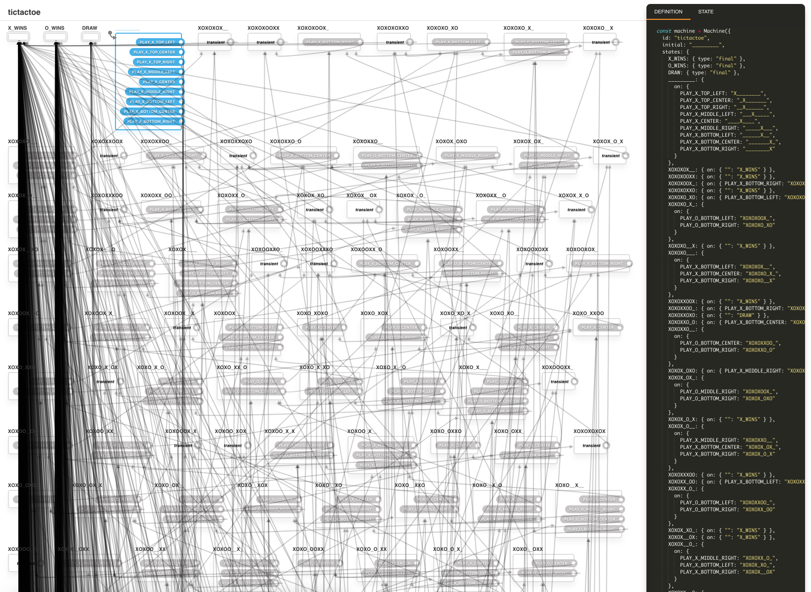

# Tic-Tac-Toe State Machine

This was an experiment of mine both to learn Typescript and also Xstate. The state machine has 5,478 game states, and three "final" states of `X_WINS`, `O_WINS`, or `DRAW`.

The state chart was generated by a fairly simple recursive algorithm, the details of which are left up to the reader as an exercise.

The only game assumption is that `X` always goes first.

## [Run It!!](https://codesandbox.io/s/oq8m1y7n7q) 👀

If you paste the contents of [`machine.ts`](blob/master/src/machine.ts) into the [Xstate Visualizer](https://statecharts.github.io/xstate-viz/), you get something that looks like the following. Pretty simple!! 🙄



## Run Locally

Based on [`create-react-app`](https://github.com/facebook/create-react-app).

```
npm install
npm start
```
